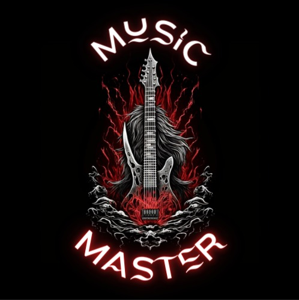

# MusicMaster
 Proyecto: Tienda de Música y Clases de Música
Tienda de Música

¡Bienvenido(a) al proyecto de la Tienda de Música y Clases de Música! Este repositorio contiene el código fuente de una página web interactiva que ofrece una amplia gama de productos musicales y servicios de enseñanza de música.

Descripción e Historia
La Tienda de Música es un proyecto ambicioso que nace con el propósito de brindar a los amantes de la música un lugar donde puedan explorar y adquirir instrumentos musicales de alta calidad. Además, nuestro sitio web ofrece la posibilidad de reservar citas para recibir clases de música personalizadas, impartidas por profesionales experimentados.

Nos apasiona la música y creemos firmemente en su poder para inspirar, conectar y transformar vidas. Con esta convicción en mente, decidimos crear una plataforma en línea que no solo ofrezca productos, sino que también facilite el aprendizaje y el crecimiento musical de nuestros clientes.

En nuestra tienda, encontrarás una amplia selección de instrumentos musicales de marcas reconocidas, incluyendo guitarras, pianos, baterías, instrumentos de viento y mucho más. Además, ofrecemos una variedad de accesorios, partituras y equipos de sonido para ayudarte a llevar tu pasión musical al siguiente nivel.

Nuestro equipo está compuesto por músicos profesionales y profesores dedicados que están ansiosos por compartir su conocimiento y experiencia contigo. Ya sea que estés empezando desde cero o que desees perfeccionar tus habilidades existentes, nuestras clases de música personalizadas te ayudarán a alcanzar tus metas.

Aspectos Visuales
Diseño atractivo e intuitivo: Hemos puesto especial énfasis en crear una interfaz de usuario atractiva y fácil de usar. Nuestro diseño limpio y moderno garantiza una experiencia de navegación agradable para nuestros visitantes.

Galería de productos: Presentamos una amplia variedad de productos musicales con imágenes de alta calidad. Cada producto cuenta con una descripción detallada, especificaciones técnicas y opciones de compra convenientes.

Sección de citas: Nuestra página web incluye un sistema de reserva de citas fácil de usar. Los usuarios pueden elegir entre una variedad de opciones de clases de música, seleccionar la fecha y hora más conveniente y reservar directamente a través de nuestro sitio.

Testimonios de clientes: Mostramos testimonios de clientes satisfechos que han tenido experiencias positivas con nuestras clases de música y productos. Esto ayuda a generar confianza y credibilidad en nuestra tienda.

Información de contacto: Proporcionamos información clara y accesible sobre cómo ponerse en contacto con nosotros para consultas, preguntas o soporte técnico. Estamos comprometidos a brindar un excelente servicio al cliente.

Cómo Contribuir
Si estás interesado en contribuir al desarrollo de nuestra Tienda de Música, ¡estamos encantados de recibir tus aportes! Puedes seguir estos pasos para empezar:

Haz un fork de este repositorio y clónalo en tu máquina local.
Realiza las modificaciones o mejoras deseadas en el código.
Asegúrate de probar exhaustivamente
